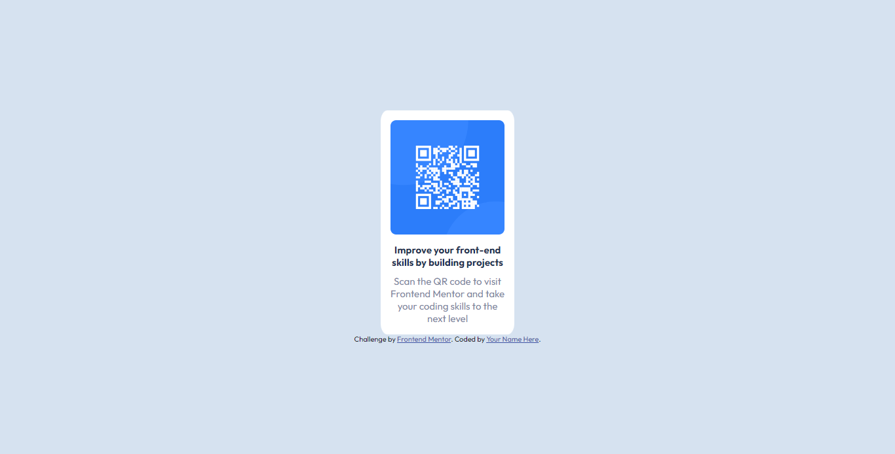

# Frontend Mentor - QR code component solution

This is a solution to the [QR code component challenge on Frontend Mentor](https://www.frontendmentor.io/challenges/qr-code-component-iux_sIO_H). Frontend Mentor challenges help you improve your coding skills by building realistic projects. 

## Table of contents

- [Overview](#overview)
  - [Screenshot](#screenshot)
  - [Links](#links)
- [My process](#my-process)
  - [Built with](#built-with)
  - [What I learned](#what-i-learned)
  - [Continued development](#continued-development)
- [Author](#author)

## Overview

### Screenshot




### Links

- Live Site URL: [Add live site URL here](https://your-live-site-url.com)

## My process

### Built with

- Semantic HTML5 markup
- CSS custom properties
- Flexbox
- Desktop-first workflow

### What I learned

I learned to differentiate between 'align-items' and 'align-content'.
I also learned how to make images responsive:
```css
img {
  width: 100%;
  height: auto;
}
```

### Continued development

I want to follow up on responsiveness especially for images.

## Author

- Website - [Martin Kiprotich](https://kiprotichmartin.github.io/bootstrapped-devfolio/)
- Frontend Mentor - [@kiprotichMartin](https://www.frontendmentor.io/profile/kiprotichMartin)
- Twitter - [@martinkiprotch](https://twitter.com/martinkiprotch)
